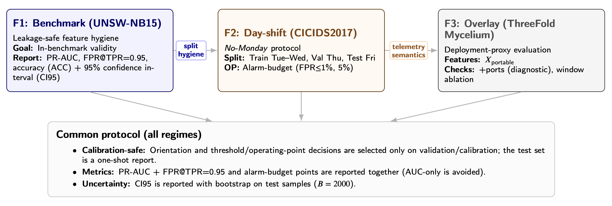

# Benchmark-to-Deployment Gap in Network Intrusion Detection  
### Reproducible Experiments with Benchmark, Day-Shift, and Overlay Testbeds

This repository contains the experimental pipeline used in the paper:

**"Benchmark Performance Is Not Deployment Validity:  
Evaluation Hygiene, Alarm Budgets, and Overlay Transfer in Network IDS"**

The goal of this project is to demonstrate that **high benchmark performance does not guarantee deployment validity** for network intrusion detection systems (IDS).  
The experiments systematically evaluate models under three regimes:

1. **Benchmark validation** (UNSW-NB15)
2. **Distribution shift** (CICIDS2017 day-based split)
3. **Deployment proxy** (ThreeFold Mycelium overlay testbed)

The repository includes scripts for dataset preparation, model evaluation, and overlay traffic generation.

---

# Overview

Typical IDS studies evaluate models using random splits within benchmark datasets.  
However, such protocols can create **deployment illusions** because:

- traffic distributions remain stable
- telemetry semantics do not change
- infrastructure effects are ignored

This work evaluates IDS models under progressively more realistic regimes:

| Evaluation regime | Dataset | Purpose |
|---|---|---|
| Benchmark validation | UNSW-NB15 | Leakage-safe baseline |
| Distribution shift | CICIDS2017 (No-Monday split) | Day-based generalization |
| Deployment proxy | Mycelium overlay | Infrastructure transfer |

---

# Repository Structure
